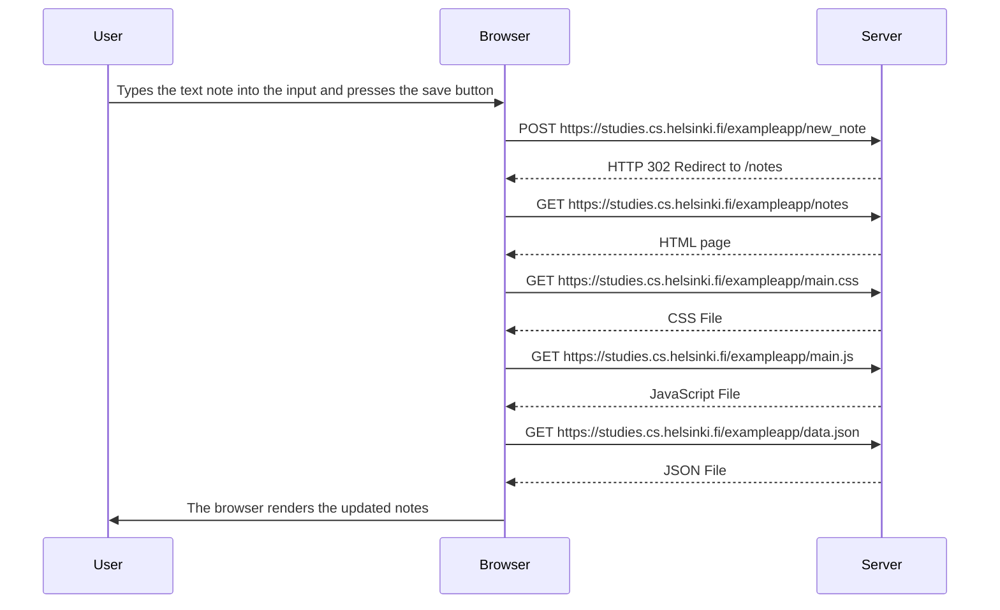

# A situation where the user create a new note on the page

```mermaid
sequenceDiagram
    participant User
    participant Browser
    participant Server

    User->>Browser: Types the text note into the input and presses the save button
    Browser->>Server: POST https://studies.cs.helsinki.fi/exampleapp/new_note
    Server-->>Browser: HTTP 302 Redirect to /notes

    Browser->>Server: GET https://studies.cs.helsinki.fi/exampleapp/notes
    Server-->>Browser: HTML page

    Browser->>Server: GET https://studies.cs.helsinki.fi/exampleapp/main.css
    Server-->>Browser: CSS File

    Browser->>Server: GET https://studies.cs.helsinki.fi/exampleapp/main.js
    Server-->>Browser: JavaScript File

    Browser->>Server: GET https://studies.cs.helsinki.fi/exampleapp/data.json
    Server-->>Browser: JSON File

    Browser->>User: The browser renders the updated notes

```
